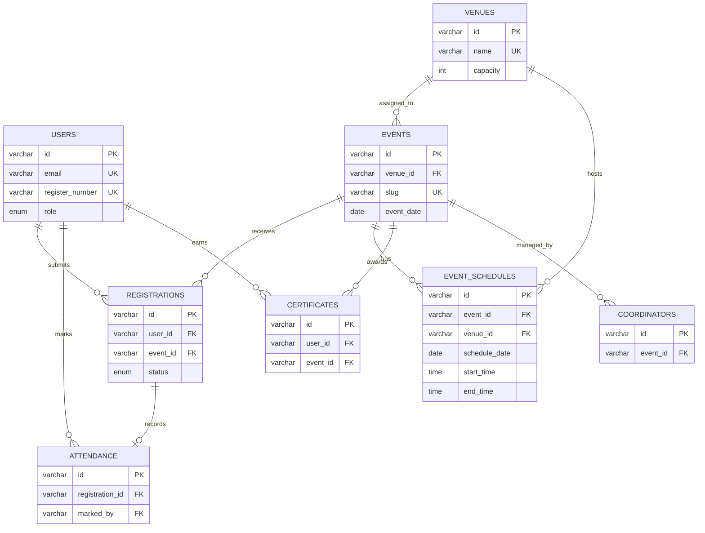

# EventSphere ER Diagram

```mermaid
erDiagram
  USERS ||--o{ REGISTRATIONS : submits
  EVENTS ||--o{ REGISTRATIONS : receives
  VENUES ||--o{ EVENTS : assigned_to
  EVENTS ||--o{ EVENT_SCHEDULES : has
  VENUES ||--o{ EVENT_SCHEDULES : hosts
  REGISTRATIONS ||--o| ATTENDANCE : records
  USERS ||--o{ ATTENDANCE : marks
  USERS ||--o{ CERTIFICATES : earns
  EVENTS ||--o{ CERTIFICATES : awards
  EVENTS ||--o{ COORDINATORS : managed_by

  USERS { varchar id PK
    varchar email UK
    varchar register_number UK
    enum role
  }
  EVENTS { varchar id PK
    varchar venue_id FK
    varchar slug UK
    date event_date
  }
  VENUES { varchar id PK
    varchar name UK
    int capacity
  }
  EVENT_SCHEDULES { varchar id PK
    varchar event_id FK
    varchar venue_id FK
    date schedule_date
    time start_time
    time end_time
  }
  REGISTRATIONS { varchar id PK
    varchar user_id FK
    varchar event_id FK
    enum status
  }
  ATTENDANCE { varchar id PK
    varchar registration_id FK
    varchar marked_by FK
  }
  CERTIFICATES { varchar id PK
    varchar user_id FK
    varchar event_id FK
  }
  COORDINATORS { varchar id PK
    varchar event_id FK
  }
```
